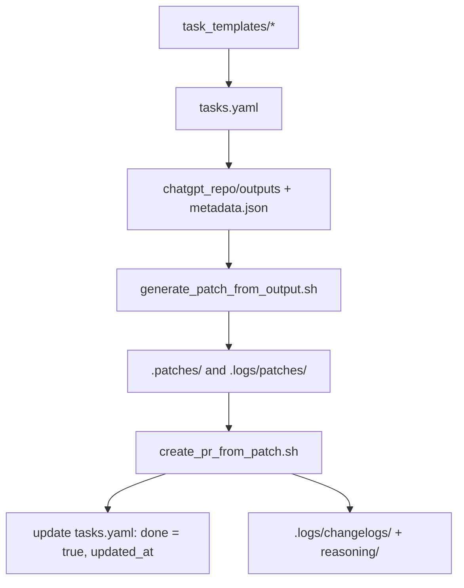

# AI-Native Task Management Framework

This document defines a scalable, AI-native framework for managing tasks across pods, phases, and sprints in a software delivery process. It integrates seamlessly with multi-pod execution, patch promotion, GPT-based task automation, and human oversight via the DeliveryPod GPT.

---

## 🧠 Core Concepts

| Concept | Description |
|--------|-------------|
| **task_templates/** | Canonical reusable tasks by SDLC phase and step |
| **tasks.yaml** | Unified backlog with task metadata including sprint and active status |
| **.logs/** | Stores metadata such as patch history, feedback, changelogs, and reasoning traces |
| **DeliveryPod GPT** | Custom GPT agent that serves as UI to manage tasks and orchestrate project planning with human |

---

## 🧩 Multi-Pod Task Support

This framework supports **parallel task execution** across multiple pods:

- Each task has metadata: `sprint: In-Sprint | Backlog`, `active: true | false`
- All task metadata lives in a single `tasks.yaml` for simplified state
- Patch scripts dynamically read from `chatgpt_repo/outputs/` and one `metadata.json`

---

## 📁 File Structure

```bash
project_root/
├── task_templates/
│   └── phase_1/1.1_capture_project_goals.yaml
├── tasks.yaml                # Unified project backlog
├── .patches/                 # Git patch files
├── .logs/
│   ├── patches/              # Patch metadata (json)
│   ├── changelogs/           # Task change history
│   └── reasoning/            # AI thought summaries
├── chatgpt_repo/
│   └── outputs/              # Raw GPT outputs (files only)
│   └── metadata.json         # Output metadata file used by patch script
└── scripts/
    ├── generate_patch_from_output.sh
    ├── create_pr_from_patch.sh
    └── complete_task.sh
```

---

## 🔄 Task Lifecycle



---

## 🛠️ Human + GPT DeliveryPod Workflow

### (1) Project Initiation
- Human runs `init_project_tasks.py` to generate `tasks.yaml` from templates

### (2) Sprint Planning Ceremony
1. Human gives GPT the prompt: _"List tasks pending or to-do for sprint planning."_
2. GPT retrieves `tasks.yaml`
3. GPT lists filtered tasks (e.g., status = pending or to-do)
4. Human selects tasks for the sprint
5. GPT updates and returns revised `tasks.yaml`
6. Human uses standard prompt to request final download block

### (3) Daily Standup
1. Human asks DeliveryPod for status update
2. GPT retrieves `tasks.yaml` and prints tasks by pod and status
3. Human selects next task
4. GPT returns:
   - Task prompt
   - Input file links
   - Output instructions with ZIP and `metadata.json`

### 🔁 Supporting Automation Rules
- `tasks.yaml` is the single source of truth for sprint, active, done
- `generate_patch_from_output.sh` reads from a single metadata.json and uses the staged outputs to create patch
- Changelogs and reasoning summaries are generated at PR time

---

## ✅ Automation Scripts

| Script | Role |
|--------|------|
| `init_project_tasks.py` | Seed `tasks.yaml` from `task_templates/` |
| `generate_patch_from_output.sh` | Generates patch from GPT output (based on `.logs/patches/metadata.json`) |
| `create_pr_from_patch.sh` | Applies patch, commits, pushes, and opens PR |
| `complete_task.sh` | Marks task as done, creates changelog + reasoning trace |

---

## 🤝 DeliveryPod GPT as UI & Orchestrator

### Custom GPT Actions

| Endpoint | Purpose |
|----------|---------|
| `/init_tasks` | Create `tasks.yaml` from templates |
| `/plan_sprint` | Return pending/backlog tasks to pick from |
| `/activate_task` | Update a task as active=true |
| `/get_prompt` | Return standard prompt for a given task and validate inputs |
| `/complete_task` | Mark task as complete and generate logs |
| `/monitor_pods` | Return status of all active tasks |

---

## ✨ Next Steps

- [x] Hide metadata in a ZIP process with `metadata.json`
- [ ] Auto-generate changelog and reasoning trace per task
- [ ] Improve PR readability with GPT-generated template
- [ ] Enable prompt replays for debugging or iteration
