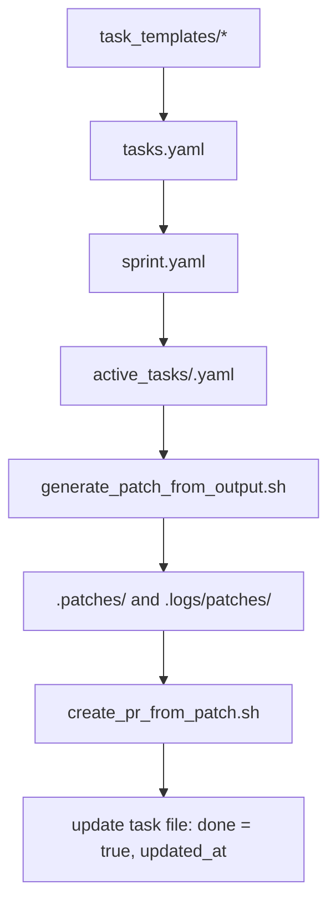

# AI-Native Task Management Framework

This document defines a scalable, AI-native framework for managing tasks across pods, phases, and sprints in a software delivery process. It integrates seamlessly with multi-pod execution, patch promotion, GPT-based task automation, and human oversight via the DeliveryPod GPT.

---

## 🧠 Core Concepts

| Concept | Description |
|--------|-------------|
| **task_templates/** | Canonical reusable tasks by SDLC phase and step |
| **tasks.yaml** | Full curated task backlog for a specific project |
| **sprint.yaml** | Subset of tasks actively prioritized for current sprint |
| **active_tasks/** | Directory with active working task.yaml files, one per pod or task ID |
| **.logs/** | Stores metadata such as patch history, feedback, and metrics |
| **DeliveryPod GPT** | Custom GPT agent that serves as UI to manage tasks and orchestrate project planning with human |

---

## 🧩 Multi-Pod Task Support

Unlike traditional single-task queues, this framework supports **parallel task execution** across multiple pods:

- `active_tasks/` holds multiple task files:
  ```
  active_tasks/1.1_capture_project_goals.yaml
  active_tasks/2.3_build_metrics_tool.yaml
  active_tasks/3.2_run_regression_tests.yaml
  ```

- Each pod (DevPod, QAPod, ResearchPod) can operate on its assigned task concurrently
- `generate_patch_from_output.sh` is enhanced to detect and operate on the appropriate task file via CLI:
  ```bash
  bash scripts/generate_patch_from_output.sh --task_file active_tasks/2.3_build_metrics_tool.yaml
  ```

---

## 📁 File Structure

```bash
project_root/
├── task_templates/
│   └── phase_1/1.1_capture_project_goals.yaml
├── tasks.yaml            # Full backlog
├── sprint.yaml           # Current prioritized tasks
├── active_tasks/         # Live working tasks (multi-pod)
│   ├── 1.1_capture_project_goals.yaml
│   ├── 2.3_build_metrics_tool.yaml
├── .patches/
├── .logs/
│   └── patches/
│   └── feedback/
└── chatgpt_repo/outputs/ # GPT generated files for staging
```

---

## 🔄 Task Lifecycle



---

## ✅ Automation Scripts

| Script | Role |
|--------|------|
| `init_project_tasks.py` | Seed `tasks.yaml` from `task_templates/` |
| `select_tasks_for_sprint.py` | Create `sprint.yaml` subset for sprint planning |
| `activate_next_task.sh` | Move one or more tasks from `sprint.yaml` to `active_tasks/` |
| `generate_patch_from_output.sh` | Generates patch from GPT output and promotes it via `--task_file` |
| `create_pr_from_patch.sh` | Applies patch, commits, pushes, and opens PR |
| `complete_task.sh` | Marks task `done: true`, updates timestamp, optionally archives completed task file |
| `promote_patch.sh` | ✅ Deprecated: replaced by patch script calling PR script directly |

---

## 🤝 DeliveryPod GPT as UI & Orchestrator

The DeliveryPod GPT acts as a collaborative interface between human and system for task lifecycle management:

### Custom GPT Actions

| Endpoint | Purpose |
|----------|---------|
| `/init_tasks` | Create `tasks.yaml` from templates |
| `/plan_sprint` | Generate `sprint.yaml` from backlog and criteria |
| `/activate_task` | Move one or more tasks into `active_tasks/` |
| `/get_active_tasks` | List active tasks with status and pod assignment |
| `/complete_task` | Mark task as complete and update logs |
| `/monitor_pods` | Return real-time status of all active tasks and assigned pods |

These routes can be added to your FastAPI server and documented in `openapi.json` for integration with GPT.

---

## 🧠 Benefits

- Scales across **multiple pods** (concurrent task execution)
- Works with **realistic project planning** (some tasks skipped, some parallel)
- Fully auditable, scriptable, and GPT-compatible
- DeliveryPod GPT becomes single point for project orchestration, planning, and tracking

---

## ✨ Next Steps

- [x] Update `generate_patch_from_output.sh` to accept `--task_file`
- [x] Replace `.task/task.yaml` with `active_tasks/<task_id>.yaml`
- [x] Add `activate_next_task.sh` and `complete_task.sh`
- [x] Update prompt templates to reflect this model
- [x] Extend FastAPI with endpoints for DeliveryPod task actions
- [x] Add `/monitor_pods` GPT action to track live pod/task status
- [ ] Build dashboard or CLI to monitor pod/task execution in real time
